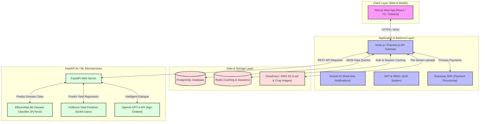
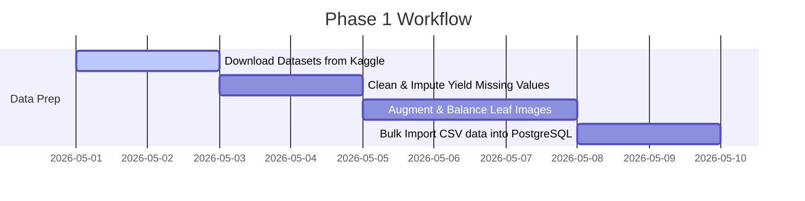
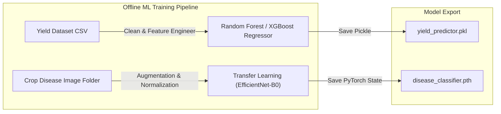
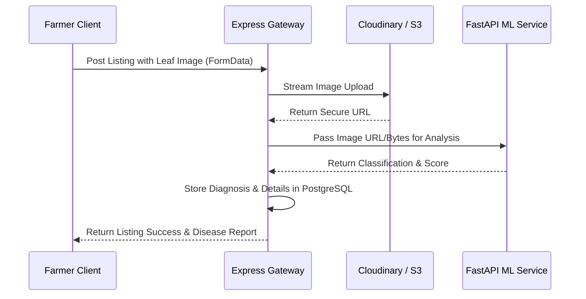

# AgriFlow
## Digital Agriculture Commerce & Intelligence Platform

---

### 🌐 Live URLs

* **Frontend:** [https://agrisphere-frontend.onrender.com](https://agrisphere-frontend.onrender.com)
* **Backend:** [https://agrisphere-backend-yu9e.onrender.com/api/health](https://agrisphere-backend-yu9e.onrender.com/api/health)
* **ML Service:** [https://agrisphere-ml-service.onrender.com/health](https://agrisphere-ml-service.onrender.com/health)

---

## Production Implementation Status

AgriFlow is currently deployed as a three-service production system on Render Free Tier:

* **Frontend Web App:** Next.js dashboard for farmers and buyers, including authentication, crop listings, marketplace browsing, disease diagnosis, yield analytics, and AgriBot chat.
* **Express Backend API:** Central API gateway for authentication, marketplace listings, orders, payments, Cloudinary uploads, historical yield analytics, chat responses, and communication with the ML service.
* **FastAPI ML Service:** Dedicated Python inference service for crop disease detection and yield prediction so ML workloads stay separate from the Node.js application server.

### Current Live Features

* **Authentication & Sessions:** JWT-based login with persistent frontend session handling and role-aware dashboard routing.
* **Farmer Listings:** Farmers can create listings with crop details, location, quantity, price, description, and crop images.
* **My Listings:** Farmers can view and manage only their own listings using the authenticated `/api/listings/mine` endpoint.
* **Marketplace:** Buyers can browse active listings from the live database through `/api/listings`.
* **Buy Now Flow:** Buyers can create orders and launch Razorpay Checkout when payment credentials are configured.
* **Disease Detection:** Farmers can upload leaf/crop images, which are processed by the backend and FastAPI ML service.
* **Yield Analytics:** The dashboard predicts crop yield and renders historical regional trend charts using Recharts.
* **AgriBot AI:** The chat UI connects to the backend chat endpoint and returns agronomy guidance, with backend fallback responses if the external AI provider is unavailable.

---

## Tech Stack Used

| Layer | Technologies |
| :--- | :--- |
| **Frontend** | Next.js 16, React 19, TypeScript, Tailwind CSS 4, Axios, React Hook Form, Zod, React Query, Recharts, Framer Motion, Lucide React, React Hot Toast, Socket.IO Client |
| **Backend** | Node.js, Express 5, TypeScript, PostgreSQL `pg`, JWT, Cookie Parser, CORS, Helmet, Morgan, Multer, Cloudinary SDK, Razorpay SDK, Socket.IO, Zod |
| **ML Service** | Python, FastAPI, Uvicorn, PyTorch CPU, Torchvision, Scikit-Learn, Pandas, NumPy, Pillow, Requests, Pydantic |
| **Database & Storage** | Neon Serverless PostgreSQL, Cloudinary image storage |
| **Payments** | Razorpay Checkout and backend payment verification |
| **Deployment** | Render Web Services for frontend, backend, and ML service |
| **AI / ML** | CNN-based crop disease classification, yield prediction model, HuggingFace-backed AgriBot with backend fallback guidance |

### Production API Surface

| Feature | Main Endpoint |
| :--- | :--- |
| Health Check | `GET /api/health` |
| Auth | `POST /api/auth/login`, `POST /api/auth/register`, `GET /api/auth/me` |
| Marketplace Listings | `GET /api/listings`, `POST /api/listings`, `GET /api/listings/mine`, `DELETE /api/listings/:id` |
| Orders & Payments | `POST /api/orders`, `POST /api/orders/verify-payment` |
| Disease Diagnosis | `POST /api/diagnosis/analyze` |
| Yield Prediction | `POST /api/yield/predict` |
| Historical Yield Trends | `GET /api/yield/historical` |
| AgriBot Chat | `POST /api/chat` |

### Environment Integrations

The production deployment uses environment variables for:

* PostgreSQL connection string through `DATABASE_URL`.
* JWT and cookie secrets for secure authentication.
* Cloudinary credentials for image uploads.
* Razorpay keys for payment checkout and verification.
* HuggingFace API key for AI chat responses.
* `ML_SERVICE_URL` for backend-to-FastAPI inference calls.
* `NEXT_PUBLIC_API_URL` or equivalent frontend API base URL for deployed frontend requests.

---

# Overview

AgriFlow is a cutting-edge, full-stack AgriTech ecosystem designed to empower farmers, buyers, and agricultural stakeholders through deep data-driven intelligence and friction-free commerce. By blending advanced computer vision, predictive regression models, robust marketplace mechanics, and real-time communication, AgriFlow turns complex agricultural data into actionable, high-yield business and farming decisions.

The platform is powered by two foundational agricultural datasets:
1. **Indian Crop Production & Yield Dataset** (by `arjunyadav99` on Kaggle) — to power historical analytics and predictive crop suitability recommendations.
2. **Top Agriculture Crop Disease India Dataset** (by `kamal01` on Kaggle) — to train deep learning models for automated computer vision disease diagnostics.

---

# Key Datasets Integrated

To deliver precise intelligence, AgriFlow integrates two main data structures:

### 1. Indian Crop Production & Yield Dataset
* **Source:** [Kaggle Dataset (arjunyadav99)](https://www.kaggle.com/datasets/arjunyadav99/indian-agriculture-crop-production-and-yield/data)
* **Core Schema Fields:** `State_Name`, `District_Name`, `Crop_Year`, `Season` (Kharif, Rabi, Summer, Whole Year, etc.), `Crop`, `Area (Hectares)`, `Production (Quintals)`, and `Yield (Quintals/Hectare)`.
* **Platform Application:** 
  - **Yield Analytics Dashboard:** Visualizes regional crop production trends, yields, and geographical distribution.
  - **AI Crop Recommendation Engine:** A Machine Learning Regression model (XGBoost/LightGBM) trained on this dataset that predicts the expected yield based on selected state, district, crop type, season, and cultivation area.

### 2. Top Agriculture Crop Disease India Dataset
* **Source:** [Kaggle Dataset (kamal01)](https://www.kaggle.com/datasets/kamal01/top-agriculture-crop-disease)
* **Core Content:** Over 13,000 high-quality labeled images (approx. 5 GB) covering major Indian cash and food crops: **Corn, Wheat, Tomato, Rice, and Potato**.
* **Diseases Covered:** Common Indian pathogens, including:
  - *Tomato:* Early Blight, Late Blight, Target Spot, Leaf Mold, Bacterial Spot.
  - *Potato:* Early Blight, Late Blight.
  - *Corn:* Common Rust, Northern Leaf Blight, Gray Leaf Spot.
  - *Rice:* Leaf Blast, Brown Spot, Neck Blast.
  - *Wheat:* Leaf Rust, Stripe Rust, Stem Rust.
* **Platform Application:**
  - **AI Crop Disease Diagnosis:** A Convolutional Neural Network (CNN / EfficientNet-B0) trained on this dataset. Farmers upload photos of crop/leaf lesions, and the system performs instant classification, returns confidence scores, and queries treatment plans.

---

# System Architecture



---

# Database Schema Design

### 1. `users` (Farmer, Buyer, Admin management)
```sql
CREATE TABLE users (
    id SERIAL PRIMARY KEY,
    name VARCHAR(255) NOT NULL,
    email VARCHAR(255) UNIQUE NOT NULL,
    password_hash VARCHAR(255) NOT NULL,
    role VARCHAR(50) CHECK (role IN ('farmer', 'buyer', 'admin')) NOT NULL,
    state VARCHAR(100),
    district VARCHAR(100),
    created_at TIMESTAMP DEFAULT CURRENT_TIMESTAMP
);
```

### 2. `crop_yields_historical` (Populated with Dataset 1 for analytics and yield validation)
```sql
CREATE TABLE crop_yields_historical (
    id SERIAL PRIMARY KEY,
    state VARCHAR(100) NOT NULL,
    district VARCHAR(100) NOT NULL,
    crop_year INT NOT NULL,
    season VARCHAR(50) NOT NULL,
    crop VARCHAR(100) NOT NULL,
    area_hectares NUMERIC(15, 2) NOT NULL,
    production_quintals NUMERIC(15, 2),
    yield_quintals_per_hectare NUMERIC(15, 4)
);
CREATE INDEX idx_historical_lookup ON crop_yields_historical (state, district, crop, season);
```

### 3. `disease_catalogue` (Prepopulated database of treatments for AI disease matches)
```sql
CREATE TABLE disease_catalogue (
    id SERIAL PRIMARY KEY,
    crop_name VARCHAR(100) NOT NULL, -- Corn, Wheat, Tomato, Rice, Potato
    disease_name VARCHAR(255) NOT NULL, -- e.g., Tomato_Early_Blight
    scientific_name VARCHAR(255),
    symptoms TEXT NOT NULL,
    organic_treatment TEXT NOT NULL,
    chemical_treatment TEXT NOT NULL,
    prevention_measures TEXT NOT NULL
);
```

### 4. `disease_diagnoses` (Logs leaf uploads and classification results)
```sql
CREATE TABLE disease_diagnoses (
    id SERIAL PRIMARY KEY,
    farmer_id INT REFERENCES users(id) ON DELETE CASCADE,
    image_url VARCHAR(512) NOT NULL,
    crop_detected VARCHAR(100) NOT NULL,
    disease_detected VARCHAR(255) NOT NULL,
    confidence_score NUMERIC(5, 4) NOT NULL,
    catalog_disease_id INT REFERENCES disease_catalogue(id),
    created_at TIMESTAMP DEFAULT CURRENT_TIMESTAMP
);
```

### 5. `listings` (Marketplace item postings)
```sql
CREATE TABLE listings (
    id SERIAL PRIMARY KEY,
    farmer_id INT REFERENCES users(id) ON DELETE CASCADE,
    crop_name VARCHAR(255) NOT NULL,
    quantity_quintals NUMERIC(10, 2) NOT NULL,
    price_per_quintal NUMERIC(10, 2) NOT NULL,
    location_state VARCHAR(100) NOT NULL,
    location_district VARCHAR(100) NOT NULL,
    image_url VARCHAR(512),
    status VARCHAR(50) CHECK (status IN ('active', 'sold', 'cancelled')) DEFAULT 'active',
    created_at TIMESTAMP DEFAULT CURRENT_TIMESTAMP
);
```

### 6. `orders` & `payments` (E-commerce transaction handling)
```sql
CREATE TABLE orders (
    id SERIAL PRIMARY KEY,
    buyer_id INT REFERENCES users(id),
    listing_id INT REFERENCES listings(id),
    quantity_ordered NUMERIC(10, 2) NOT NULL,
    total_amount NUMERIC(12, 2) NOT NULL,
    status VARCHAR(50) CHECK (status IN ('pending', 'paid', 'shipped', 'completed', 'cancelled')) DEFAULT 'pending',
    created_at TIMESTAMP DEFAULT CURRENT_TIMESTAMP
);

CREATE TABLE payments (
    id SERIAL PRIMARY KEY,
    order_id INT REFERENCES orders(id) ON DELETE CASCADE,
    payment_gateway VARCHAR(50) DEFAULT 'Razorpay',
    transaction_id VARCHAR(255) NOT NULL,
    payment_status VARCHAR(50) NOT NULL,
    amount_paid NUMERIC(12, 2) NOT NULL,
    paid_at TIMESTAMP DEFAULT CURRENT_TIMESTAMP
);
```

---

# 🚀 Phase-by-Phase Roadmap

This phase-by-phase timeline outlines the implementation strategy to take AgriFlow from ingestion of both Kaggle datasets to production-ready scalable cloud deployment.

---

## Phase 1: Datasets Acquisition & Data Engineering
**Goal:** Prepare, structure, and clean datasets for machine learning pipeline and SQL ingestion.



### Key Deliverables
* **Yield Dataset Preprocessing:** 
  - Handle missing production/yield values in the `indian-agriculture-crop-production-and-yield` CSV using regional mean imputation.
  - Standardize State and District spellings (e.g., matching eNAM/Agmarknet specifications).
* **Disease Dataset Preprocessing:**
  - Structure `top-agriculture-crop-disease` images into standard classification directories (`train/`, `val/`, `test/`).
  - Perform image transformations: Resize to 224x224, apply random contrast, rotation, horizontal flips, and color jitter to augment minority classes.
* **Database Ingestion:**
  - Spin up PostgreSQL locally or in Docker.
  - Set up migrations and run bulk copy scripts to load historical yield rows into `crop_yields_historical` table.
  - Seed `disease_catalogue` with agricultural guidance corresponding to the disease categories.

---

## Phase 2: Core Full-Stack Foundation & Auth
**Goal:** Construct backend API skeleton, frontend structure, and client authentication mechanisms.

### Key Deliverables
* **Backend Repository (Node.js/Express/TypeScript):**
  - Set up directory structure (controllers, services, routes, models, config).
  - Implement Prisma ORM or PG-Pool connection helpers.
  - Set up JWT Token authentication with cookie parsing and role validation middleware (`isFarmer`, `isBuyer`, `isAdmin`).
* **Frontend Repository (Next.js/TypeScript/Tailwind CSS):**
  - Initialize using custom styling tokens.
  - Create responsive main shell: Sidebar, Navbar, Mobile navigation.
  - Form validation for Signup/Login with custom role toggle (Farmer vs. Buyer interface).
* **Environment Configurations:**
  - Implement clean validation of `.env` files using `zod` or `dotenv`.

---

## Phase 3: AI & ML Model Development
**Goal:** Build, train, and save high-accuracy predictive ML models.



### Key Deliverables
* **AI Yield Model:**
  - Feature engineering: One-hot encode `State_Name`, `District_Name`, `Season`, and `Crop`. Scale `Area` using standard scaling.
  - Train an **XGBoost/LightGBM Regressor** using k-fold cross-validation. Target: `Yield (Quintals/Hectare)`.
  - Export the model weights and label encoders (`yield_predictor.pkl`).
* **AI Crop Disease Classification Model:**
  - Implement transfer learning using **PyTorch/TensorFlow** on a pre-trained **EfficientNet-B0** or **ResNet-50** model.
  - Adjust classifier head to output classes mapping to the disease categories (Tomato, Corn, Wheat, Rice, Potato diseases).
  - Train with early stopping, tracking cross-entropy loss and F1-score. Target >92% accuracy.
  - Save the model weights (`disease_classifier.pth`).

---

## Phase 4: FastAPI ML Service Development
**Goal:** Wrap model artifacts into a microservice using Python & FastAPI.

> [!NOTE]
> Separating ML inference into a FastAPI service ensures that heavy matrix operations do not block the primary Node.js event loop, guaranteeing maximum API throughput.

### Key Deliverables
* **FastAPI Setup:**
  - Set up basic structure, dependencies (`torch`, `xgboost`, `fastapi`, `uvicorn`, `pillow`, `numpy`).
* **Inference Endpoint `/predict/disease`:**
  - Accept multipart leaf image uploads.
  - Perform image pre-processing (tensor conversion, normalize matching ImageNet coefficients).
  - Perform inference using `disease_classifier.pth` and return:
    ```json
    {
      "crop": "Tomato",
      "disease": "Tomato_Early_Blight",
      "confidence": 0.9421
    }
    ```
* **Inference Endpoint `/predict/yield`:**
  - Accept state, district, crop, season, and area values.
  - Return expected production and crop yield values.

---

## Phase 5: Analytics Dashboards & Yield Recommendation UI
**Goal:** Create frontends to visualize historical patterns and interact with ML recommendations.

### Key Deliverables
* **Crop Production & Yield Analytics (Next.js & Express):**
  - Implement aggregated analytics backend queries: Top-performing crops by state, seasonal yield analysis.
  - Render beautiful interactive charts (Recharts / Chart.js) allowing interactive state-level and crop-level filtering.
* **Crop Yield Predictor & Recommendation Tool:**
  - Form UI for farmers: Input dropdowns for State, District, Crop, Season, and Area (populated dynamically based on PostgreSQL entries).
  - Query FastAPI backend synchronously to fetch predictions and display them beautifully using custom glassmorphic progress cards and gauge meters.

---

## Phase 6: Marketplace & Media Upload Infrastructure
**Goal:** Deploy transactional capabilities, listing systems, and image streaming pipelines.



### Key Deliverables
* **Media Upload Pipelines:**
  - Integrate `multer` (Express) and SDKs for Cloudinary or AWS S3.
  - Store crop listings and diagnosis leaf photo uploads securely.
* **Listing & Commerce API:**
  - Implement Marketplace endpoints: `POST /api/listings` (Farmers), `GET /api/listings` (Search, geo-filtering, status-filtering), `PUT /api/listings/:id` (updating stock).
* **Frontend Marketplace Catalog:**
  - Premium listing grid featuring category filtering, pagination, crop image displays, and direct buy controls.

---

## Phase 7: Disease Diagnosis Engine & AI Chatbot
**Goal:** Close the feedback loop by matching ML findings with actionable advice and localized chat systems.

### Key Deliverables
* **AI Diagnosis Action Interface:**
  - Farmer uploads leaf photo -> System returns diagnosis.
  - Express backend captures the FastAPI result and queries the `disease_catalogue` using the detected label.
  - Render a stunning, readable **Diagnosis Report Card** detailing symptoms, organic remedies, chemical options, and prevention schedules.
* **AgriFlow AI Chatbot (LLM-backed):**
  - Integrate OpenAI GPT-4 API inside a custom streaming route.
  - Feed the prompt with system instructions constraining the LLM to localized Indian agricultural knowledge, utilizing the context of the user's diagnosed crops.
  - Build a sleek, interactive conversational interface with floating controls.

---

## Phase 8: Integration, Payments, WebSockets & Production Deploy
**Goal:** Wire transactional gateways, live sync alerts, Docker containers, and live deployment configurations.

### Key Deliverables
* **Razorpay Payment Gateway:**
  - Front-end checkout flow using Razorpay Checkout script.
  - Express backend validation endpoint verifying webhook signatures (`razorpay_signature`).
  - Securely transit order statuses from `pending` to `paid` upon successful verification.
* **Real-time WebSockets Alerts:**
  - Socket.IO server initialization.
  - Push immediate notices to farmers when a buyer buys their listings.
  - Broadcast regional price fluctuations or crop safety bulletins.
* **Dockerization & Multi-container Deploy:**
  - Write multi-stage `Dockerfile` configurations for Next.js, Express, and FastAPI.
  - Orchestrate using `docker-compose.yml` defining networks and mounting PostgreSQL and Redis storage.
  - Configure GitHub Actions for automatic container deployment to AWS ECS / Vercel / Render.

---

# Phase Overview Table

| Phase | Core Focus | Kaggle Datasets Used | Key Technology / Library | Delivery Target |
| :--- | :--- | :--- | :--- | :--- |
| **Phase 1** | Dataset Setup & Data Engineering | Both Datasets | Pandas, PostgreSQL, PyTorch `ImageFolder` | Week 1 |
| **Phase 2** | Architecture & Auth Setup | None | Express, JWT, Next.js, Tailwind CSS | Week 2 |
| **Phase 3** | AI Model Training & Export | Both Datasets | PyTorch, Scikit-Learn, XGBoost | Week 3 |
| **Phase 4** | FastAPI Inference API | Saved Model Weights | FastAPI, Uvicorn, Pillow, PyTorch | Week 4 |
| **Phase 5** | Dashboards & Predictor UI | Crop Production (Dataset 1) | Next.js, Recharts, Express API | Week 5 |
| **Phase 6** | Marketplace & Media Pipeline | None | Cloudinary SDK, AWS S3, Multer | Week 6 |
| **Phase 7** | Disease Diagnosis & LLM Chat | Disease India (Dataset 2) | OpenAI GPT-4 API, SQL Catalogs | Week 7 |
| **Phase 8** | Razorpay, WebSockets & CI/CD | None | Razorpay, Socket.IO, Docker, GitHub Actions | Week 8 |

---

# Future Roadmap Scope

* **Multilingual AI Voice Assistant:** Introduce voice-to-text input supporting regional Indian languages (Hindi, Telugu, Tamil, Marathi, Punjabi) to make the marketplace and AI diagnosis systems highly accessible to non-literate farmers.
* **Agrometeorological IoT Integrations:** Allow soil moisture and weather sensor telemetry to feed directly into the predictive analytics pipeline for dynamic irrigation recommendations.
* **Logistics & Delivery Syncing:** Integrate maps API with logistics partners to coordinate crop pickup direct from farms to buyer shipping addresses.
